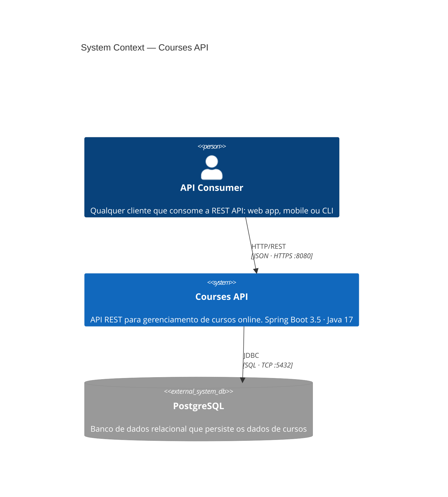
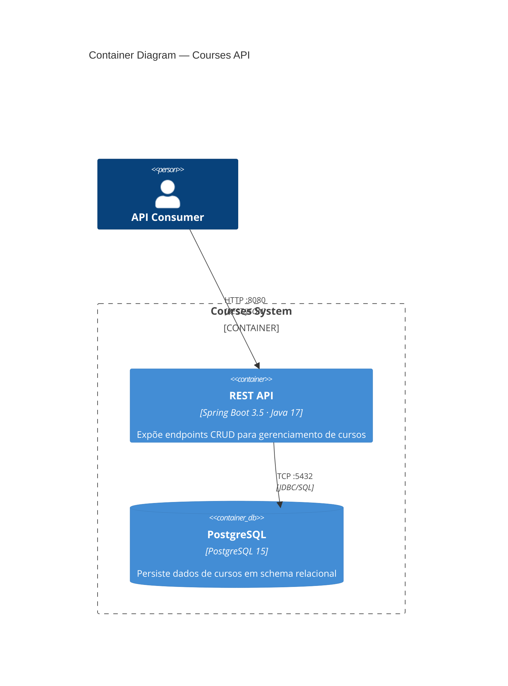
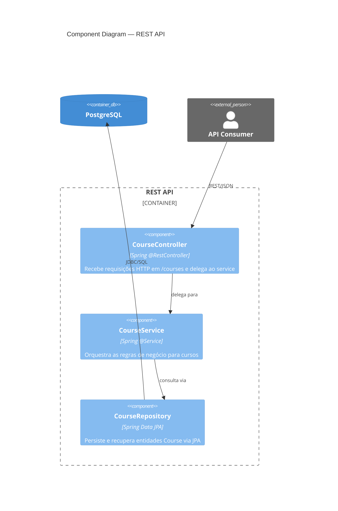
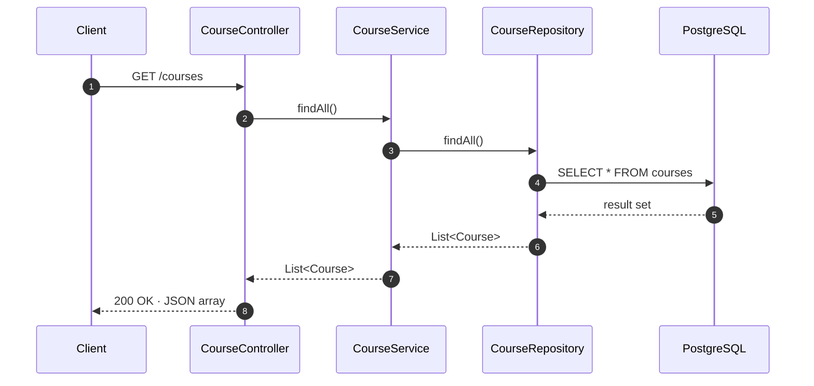
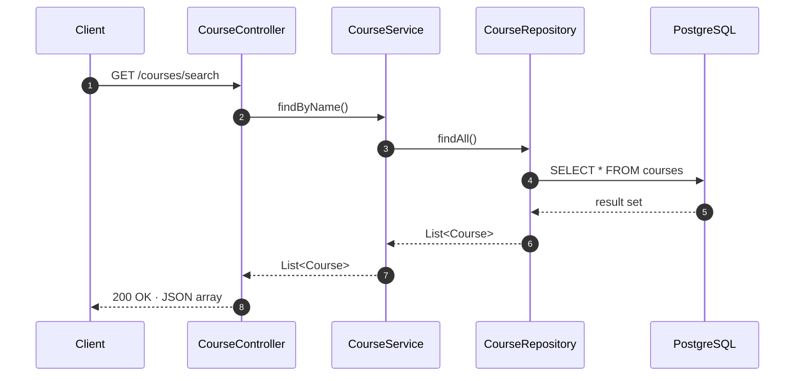
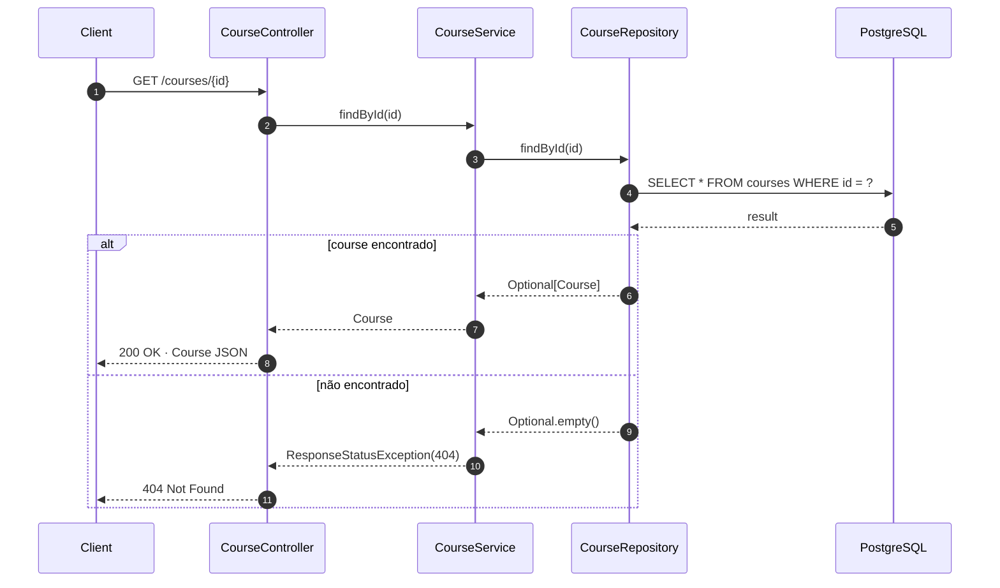
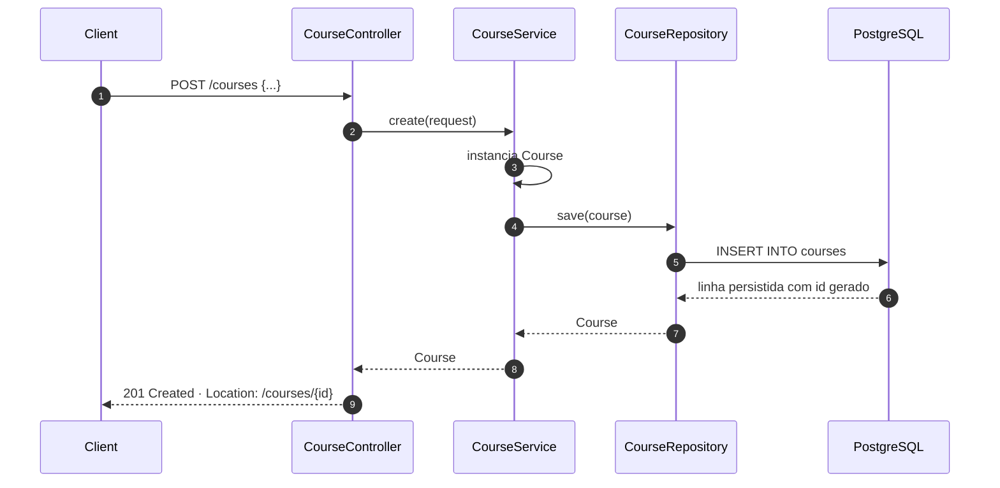
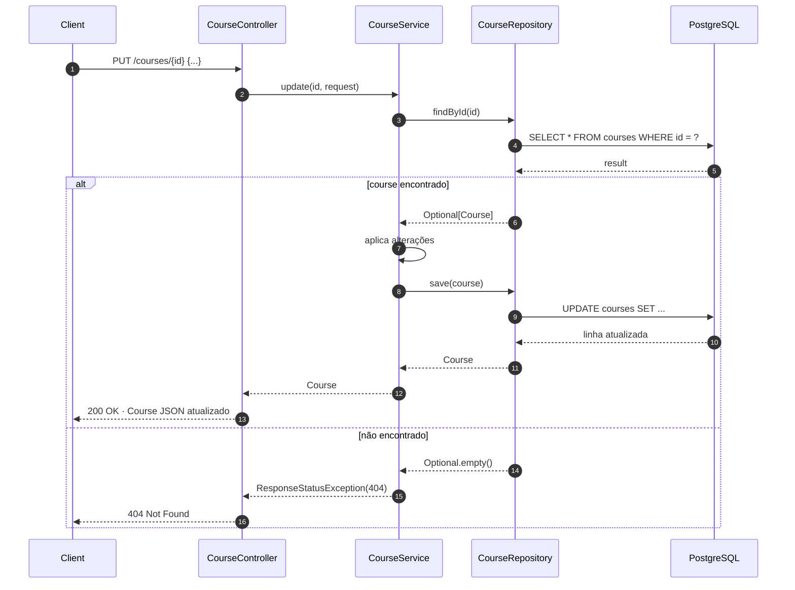
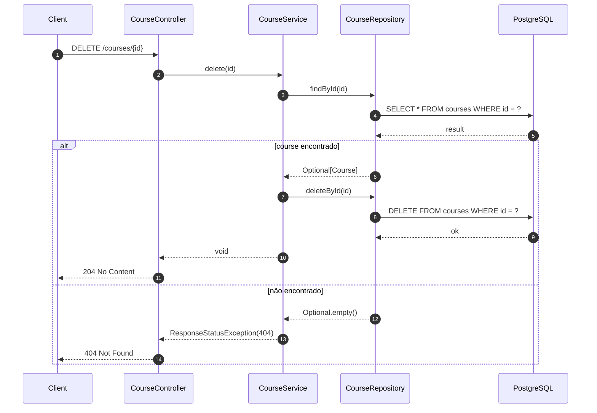
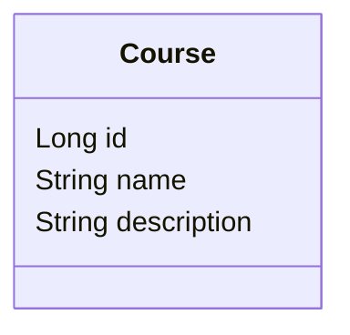

# Architecture Documentation

> **Last updated:** 2026-05-29 15:24 UTC by GitHub Actions
>
> Seções marcadas com `AUTO_GENERATED` são atualizadas automaticamente pela pipeline a cada PR.
> As demais seções (C4 e fluxos) devem ser mantidas manualmente.

---

## C4 Model

### Level 1 — System Context

### Level 2 — Container

### Level 3 — Component

---

## API Flows

<!-- FLOWS_START -->
### GET /courses

### GET /courses/search

### GET /courses/{id}

### POST /courses

### PUT /courses/{id}

### DELETE /courses/{id}

<!-- FLOWS_END -->

---

## Data Model

<!-- AUTO_GENERATED_START -->

<!-- AUTO_GENERATED_END -->

---

## API Endpoints

<!-- ENDPOINTS_START -->
| Method | Path |
|--------|------|
| `GET` | `/courses` |
| `GET` | `/courses/search` |
| `GET` | `/courses/{id}` |
| `POST` | `/courses` |
| `PUT` | `/courses/{id}` |
| `DELETE` | `/courses/{id}` |
<!-- ENDPOINTS_END -->